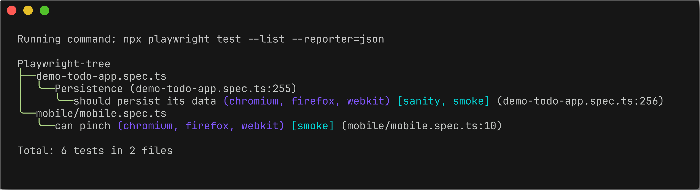
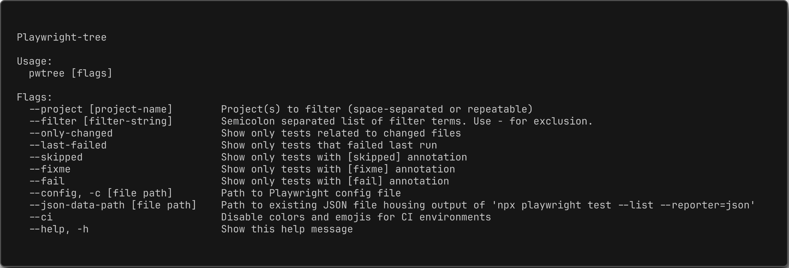

 <h2 align=center>🎭 Playwright-tree (pwtree)</h2>
<p align="center">
</p>

<p align="center">
A terminal tree-view of your Playwright suite
</p>


## Features

- 🌲 A new tree display of your Playwright suite
- 🏗 Configurable and customizable display and style options



#### Table of Contents

- [Installation](#installation)
- [Command line arguments](#command-line-arguments)

  - [Filter](#filter)
  - [Skipped](#skipped)
  - [Fixme](#fixme)
  - [Fail](#fail)
  - [JSON data path](#JSON-data-path)
  - [Help mode](#help-mode)
  - [CI mode](#ci-mode)

- [Configuration](#configuration)

---

## Installation

## Command line arguments

To view all files and their respective suites/tests:

```bash
pwtree
```

### Filter

To display specific suite and/or test titles:

```bash
pwtree --filter "Persistence;Editing files"
```

To display only tests with specific tags:

```bash
pwtree --filter "@smoke;@sanity"
```

To not show a title or tag in tree, prefix with "-":

```bash
pwtree --filter "-@smoke;-Persistence"
```

### Skipped

To display only suites/tests that have ".skip":

```bash
pwtree --skipped
```

### Fixme

To display only suites/tests that have ".fixme":

```bash
pwtree --fixme
```

### Fail

To display only suites/tests that have ".fail":

```bash
pwtree --fail
```

### JSON data path

If you store the output of `npx playwright test --list --reporter=json` in a separate file, and you'd like to use that file to generate a tree display in the terminal:

```bash
pwtree --json-data-path ./playwright.dev.config.ts
```

## Help mode

All available commands, including common Playwright arguments such as "--only-changed" and "--project" are included in the help menu:

```bash
pwtree --help
```



## CI mode

You may want to run `pwtree` in continuous integration, without custom colors or emojis.

```bash
pwtree --ci
```

## Configuration

If you want to configure certain display, emoji and style options, you can do so in two ways:

1. Create a `.pwtree.json` in the Playwright project's root directory
2. For global configurations you can create a config.json file in the ~/.config/pwtree/ directory

The content should be in the following format:

```json
{
  "showProjects": true,
  "showTags": true,
  "showFileLines": true,
  "emojis": {
    "root": "🎭",
    "file": "🧪",
    "suite": "📁"
  },
  "styles": [
    {
      "name": "enumerator",
      "color": "150",
      "bold": true,
      "italic": false,
      "faint": false
    },
    {
      "name": "root",
      "color": "7",
      "bold": true,
      "italic": false,
      "faint": false
    },
    {
      "name": "item",
      "color": "7",
      "bold": true,
      "italic": false,
      "faint": false
    },
    {
      "name": "tag",
      "color": "6",
      "bold": false,
      "italic": false,
      "faint": false
    },
    {
      "name": "project",
      "color": "4",
      "bold": false,
      "italic": true,
      "faint": true
    },
    {
      "name": "fileLine",
      "color": "7",
      "bold": false,
      "italic": true,
      "faint": true
    },
    {
      "name": "skipped",
      "color": "10",
      "bold": false,
      "italic": true,
      "faint": false
    },
    {
      "name": "fixme",
      "color": "3",
      "bold": false,
      "italic": true,
      "faint": false
    },
    {
      "name": "fail",
      "color": "5",
      "bold": false,
      "italic": true,
      "faint": false
    },
    {
      "name": "test",
      "color": "7",
      "bold": false,
      "italic": false,
      "faint": false
    },
    {
      "name": "counter",
      "color": "7",
      "bold": false,
      "italic": true,
      "faint": true
    },
    {
      "name": "file",
      "color": "7",
      "bold": true,
      "italic": false,
      "faint": false
    },
    {
      "name": "suite",
      "color": "7",
      "bold": true,
      "italic": false,
      "faint": false
    }
  ]
}
```
